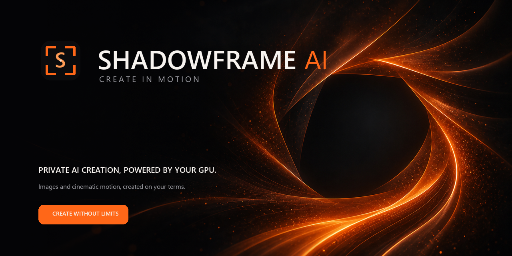

# Shadowframe AI

Shadowframe AI is a Windows-first local creative generation app built around ComfyUI. It gives users a cleaner interface for image and video workflows while keeping models, prompts, uploads, and outputs on their own machine.

Public site: [shadowframe.tech](https://shadowframe.tech/)

Brand assets and usage guidance: [BRAND.md](BRAND.md)

## What this repository contains

This repo currently supports two Shadowframe tracks:

- Public release track — safer packaged release flow intended for broader distribution
- Creator/private track — the fuller local studio workflow used for development and internal testing

The current tagged release is `v0.3.5`.

## v0.3.5 public release summary

`v0.3.5` finalizes the public-release packaging lane.

Highlights:

- dedicated `public` release profile
- public installer ships SFW sample prompts only
- public uploads are validated before they reach ComfyUI
- installer UI clearly identifies the package as the public edition
- public packaging is versioned separately from the creator/private local workflow

GitHub release draft text lives here:

- [docs/GITHUB-RELEASE-v0.3.5.md](docs/GITHUB-RELEASE-v0.3.5.md)

## Public release artifacts

The clean public handoff folder is:

- `release/Shadowframe-Installer-Public-0.3.5`

Key artifact checksums:

- `Shadowframe Setup.exe` — `5D903C035503A2F1D4BABA8CA722035F3C5FA406033BB80AC75F24949EB915D9`
- `Shadowframe-Core.tar` — `99E8CC0935D1CA0DE72A091430FE5D528832DEC4F1D6A4A485E3B739F5DB6B39`
- `Shadowframe-Package.json` — `7D9848C50D1C04CDAE185E262499083FA05EDC9D6162A03EAF8E03CFD6095918`
- `Shadowframe-ReleaseProfile.json` — `10F33B2B8841D5FF0E41A7C8357407C151A90371A9B01F0B174258ADCE090788`

## How Shadowframe is packaged

Shadowframe is split into a Core installer plus separate model packs.

Core:

- desktop launcher
- local web service
- bundled ComfyUI runtime
- Python runtime
- Node runtime
- bridge scripts
- workflow code

Model packs:

- Anima Image Models
- Wan 2.2 Video Models
- PhotoReal Image and Video Models

This keeps the app install separate from very large model payloads.

## Installer flow

Core Setup is the main entry point for users.

It can:

- install Shadowframe Core
- let the user choose app, data, and output locations
- chain adjacent model-pack installers automatically
- expose bundled sample prompt folders at the end of setup

Important scripts:

- `pnpm core:build`
- `pnpm core:build:public`
- `pnpm installer:build`
- `pnpm installer:build:public`
- `pnpm models:build`
- `pnpm beta:build`

## Current modes

Shadowframe’s source app currently includes these generator/tool surfaces:

- Text → Image
- Image → Image
- Image → Video
- Text → Video
- Outfit Replace

Public-release behavior can intentionally differ from the creator/private local build depending on the selected release profile.

## Runtime model families

Current model families in this repo:

- Anima image workflows
- Wan 2.2 video workflows
- PhotoReal image/video workflows including RedCraft, Moody Real Mix, and LTX-based work

See:

- [docs/MODEL-PACKS.md](docs/MODEL-PACKS.md)

## Windows launcher

`Shadowframe.exe` is the day-to-day Windows launcher for local use. It starts the local Shadowframe runtime, opens the app in a dedicated desktop window, and exposes desktop controls such as:

- Stop & Exit
- Restart bridge
- Friend access

The launcher and staged runtime are built from this repo and are intentionally kept out of Git as release artifacts.

## Bridge model

Shadowframe uses a local bridge so the UI can talk to the local ComfyUI runtime without exposing the user’s machine broadly.

Depending on the setup, users can:

- run locally
- use the private bridge pairing flow
- share access deliberately through the friend-access flow

The bridge and local runtime are documented here:

- [docs/PHASE-1-CORE.md](docs/PHASE-1-CORE.md)
- [docs/PHASE-2-INSTALLER.md](docs/PHASE-2-INSTALLER.md)
- [docs/TECHNICAL-REFERENCE.md](docs/TECHNICAL-REFERENCE.md)

## Development

If you are running from source:

1. install dependencies with `pnpm install`
2. start or configure the local ComfyUI-side runtime as needed
3. run the local app with `pnpm dev`

Build checks commonly used in this repo:

- `pnpm lint`
- `pnpm build:pages`
- `pnpm core:test`
- `pnpm installer:test`
- `pnpm models:test`
- `pnpm models:verify`

## Documentation

- [CHANGELOG.md](CHANGELOG.md)
- [docs/RELEASE-NOTES.md](docs/RELEASE-NOTES.md)
- [docs/RELEASE-CHECKLIST.md](docs/RELEASE-CHECKLIST.md)
- [docs/PACKAGING-LOG.md](docs/PACKAGING-LOG.md)
- [docs/BETA-HANDOFF.md](docs/BETA-HANDOFF.md)
- [docs/GITHUB-REPOSITORY-NOTES.md](docs/GITHUB-REPOSITORY-NOTES.md)
- [docs/PHASE-1-CORE.md](docs/PHASE-1-CORE.md)
- [docs/PHASE-2-INSTALLER.md](docs/PHASE-2-INSTALLER.md)
- [docs/MODEL-PACKS.md](docs/MODEL-PACKS.md)
- [docs/PUBLIC-RELEASE-PROFILE.md](docs/PUBLIC-RELEASE-PROFILE.md)
- [docs/TECHNICAL-REFERENCE.md](docs/TECHNICAL-REFERENCE.md)

## Repository safety

Keep the following out of commits:

- local outputs
- personal source images
- bridge credentials
- tunnel tokens
- local state files
- model binaries
- machine-specific environment files

Release artifacts under `release/` are intentionally treated as packaging output, not normal source files.
